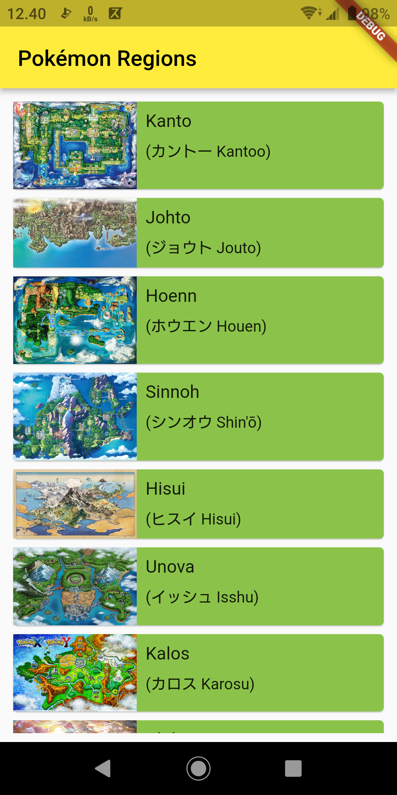
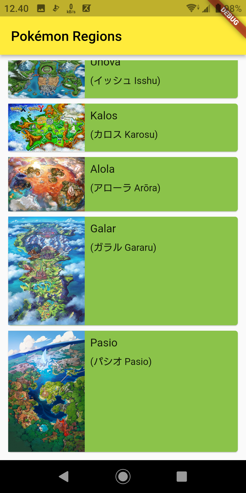
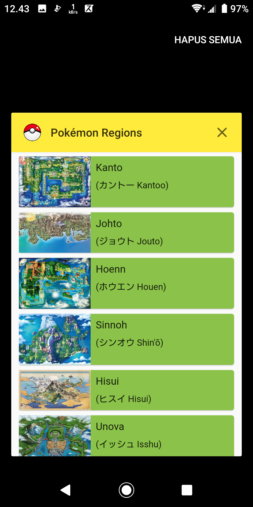
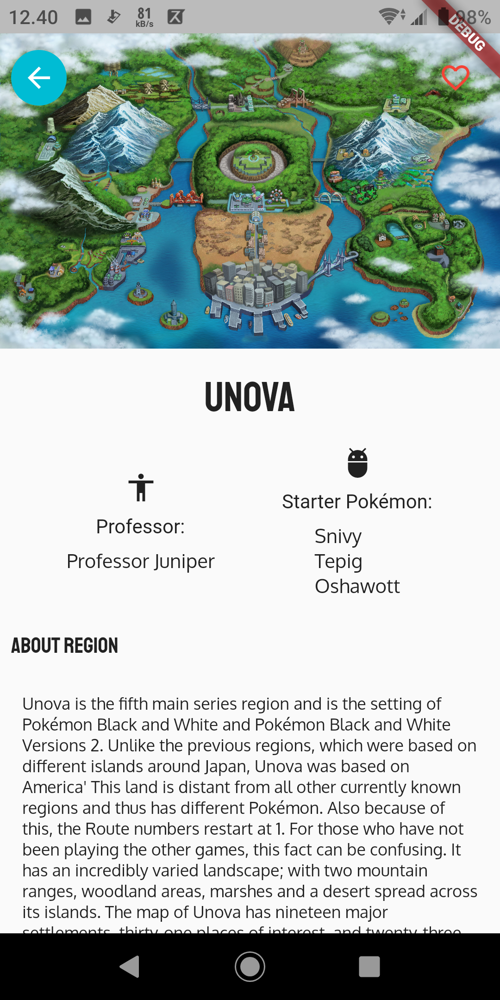
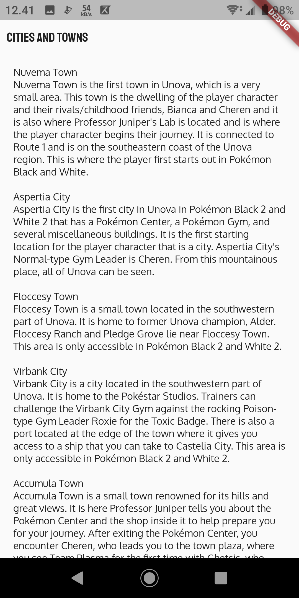
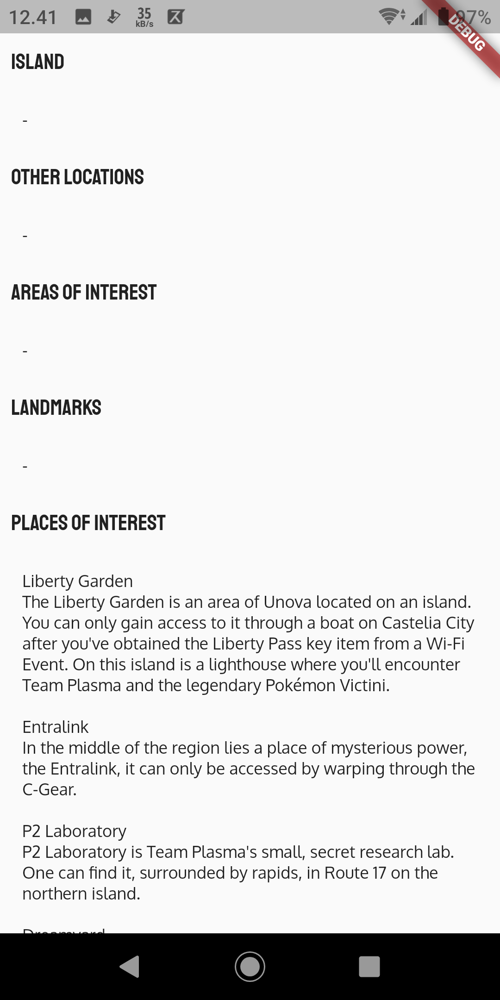
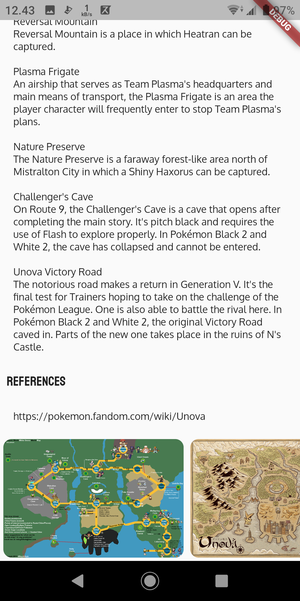

# pokemon_regions
An application that displays region information in Pokémon

This app is similar to this [project](https://github.com/krisnadwia/simple-recyclerview-app), but made with Flutter

https://www.dicoding.com/academies/159

Download this app: https://drive.google.com/drive/folders/1OBw51LPDKo55HKMDbNsD-rokHY5J2yfV?usp=share_link

## Screenshots
&nbsp;&nbsp;&nbsp;
&nbsp;&nbsp;&nbsp;
&nbsp;&nbsp;&nbsp;

&nbsp;&nbsp;&nbsp;
&nbsp;&nbsp;&nbsp;
&nbsp;&nbsp;&nbsp;

&nbsp;&nbsp;&nbsp;

A new Flutter project.

## Getting Started

This project is a starting point for a Flutter application.

A few resources to get you started if this is your first Flutter project:

- [Lab: Write your first Flutter app](https://flutter.dev/docs/get-started/codelab)
- [Cookbook: Useful Flutter samples](https://flutter.dev/docs/cookbook)

For help getting started with Flutter, view our
[online documentation](https://flutter.dev/docs), which offers tutorials,
samples, guidance on mobile development, and a full API reference.
